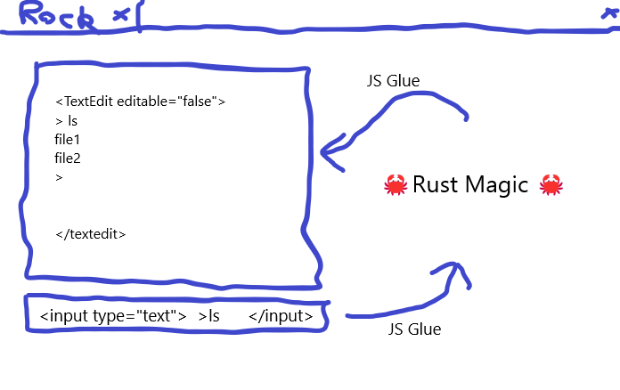

# PebbleProtectors

A FOSS version of the [Rock Defenders](https://cybergamesuk.com/rock-defenders) cybersecurity game written in TypeScript using the [phaser](https://github.com/phaserjs/phaser) framework.

<!-- omit from toc -->
## Contents

- [Project Structure](#project-structure)
- [Notes for Developers](#notes-for-developers)
- [Concept Art](#concept-art)
- [License](#license)

## Project Structure

```text
PebbleProtectors/             - Root directory for the project.
├── docs/                     - Documentation home for the project.
│   ├── images/               - Images used throughout MarkDown documentation should be stored here.
│   └── Contributing_Guide.md - A full guide on how to start contributing to the project.
├── public/
│   ├── assets/               - Contains the static assets used by the game.
│   ├── favicon.png           - An icon for the game which can be displayed by the browser.
│   └── style.css             - Some simple CSS rules to help with page layout.
├── src/                      - Contains the Vue source code.
│   ├── components/
│   │   └── icons/
│   ├── game/                 - Contains the game source code.
│   │   ├── scenes/           - The Phaser Scenes are in this folder.
│   │   │   ├── Boot.ts
│   │   │   ├── Game.ts
│   │   │   ├── GameOver.ts
│   │   │   ├── MainMenu.ts
│   │   │   └── Preloader.ts
│   │   ├── EventBus.ts       - A simple event bus to communicate between Vue and Phaser.
│   │   ├── main.ts           - The main game entry point. This contains the game configuration and starts the game.
│   │   └── PhaserGame.vue    - The Vue component that initialises the Phaser Game and serves as a bridge between Vue and Phaser.
│   ├── App.vue               - The main Vue component.
│   ├── main.ts               - The main Vue entry point. This bootstraps the Vue application.
│   └── vite-env.d.ts         - Global TypeScript declarations, provide types information.
├── vite/
├── .editorconfig             - Shared project editor configuration (https://editorconfig.org/).
├── .eslintrc.cjs             - Shared project ESLint configuration (https://eslint.org/docs/latest/use/configure/configuration-files).
├── env.d.ts
├── index.html                - A basic HTML page to contain the game.
├── LICENSE                   - PebbleProtectors license.
├── package-lock.json         - NPM manifest.
├── package.json              - NPM package information.
├── README.md                 - Main project README (you are here!).
├── tsconfig.app.json
├── tsconfig.json
└── tsconfig.node.json
```

## Notes for Developers

To start contributing, please see the [Contributing_Guide.md](./docs/Contributing_Guide.md) to set up your dev environment and get started building the project.

## Concept Art



## License

Licensed under the [GNU Affero General Public License, version 3.0](https://www.gnu.org/licenses/agpl-3.0.txt). See [LICENSE](./LICENSE) for an offline version.