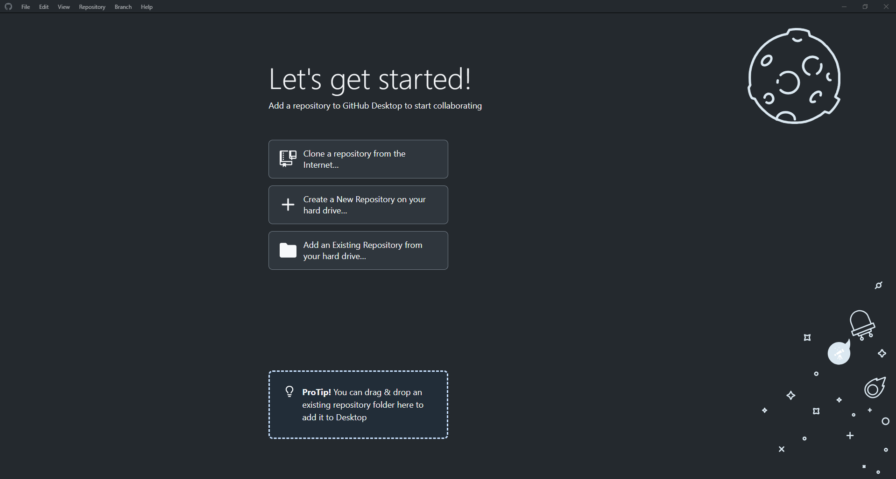
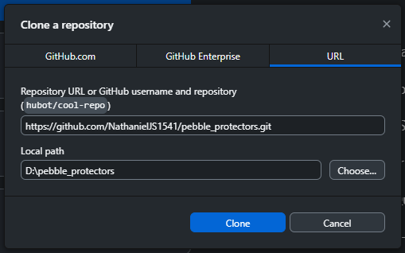
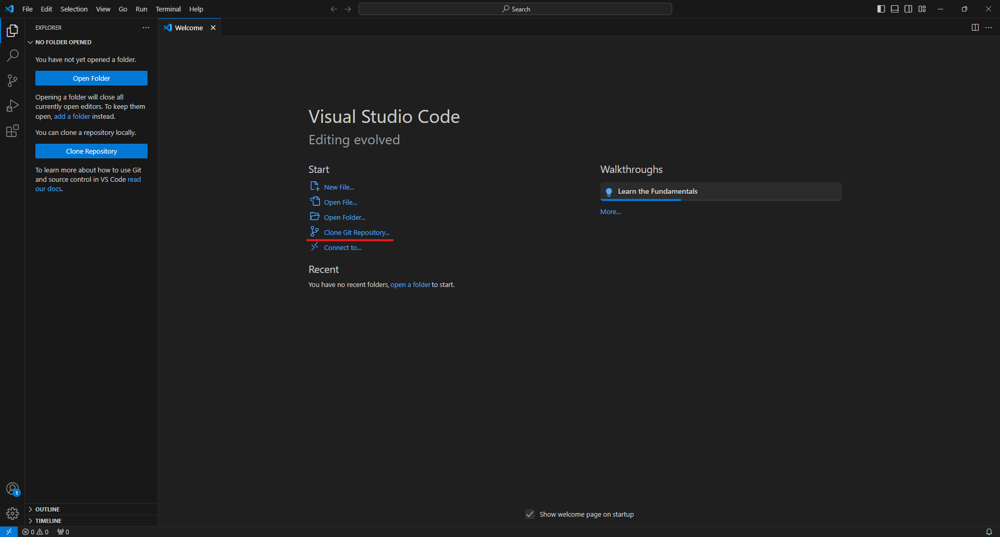
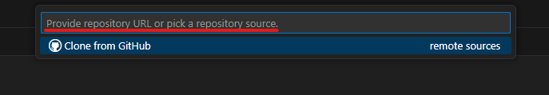
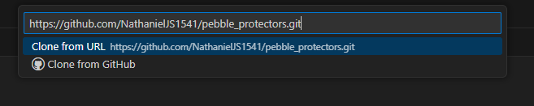
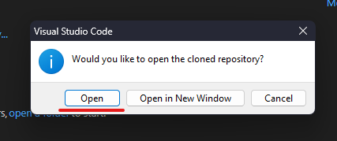
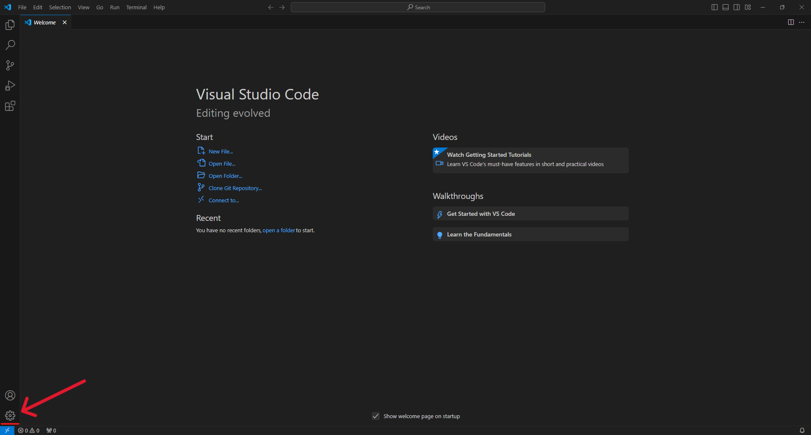
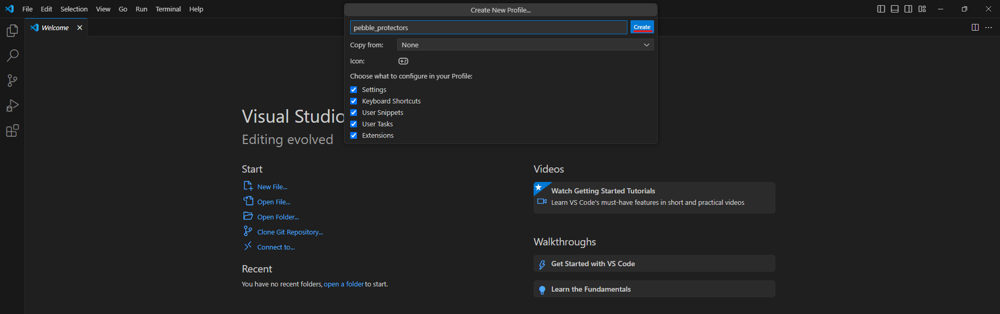
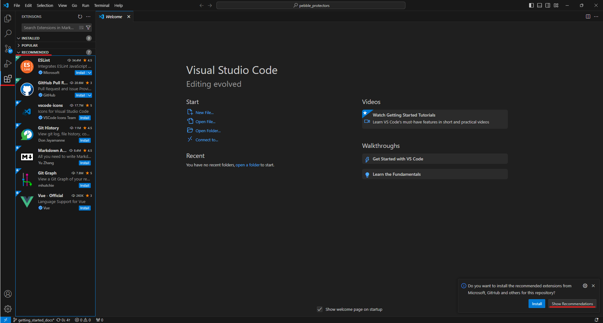
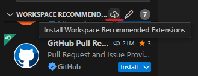

# Installing Required Programs

In this section, we'll look at getting an IDE set up and the programs you'll need to get the project running locally.

<!-- omit from toc -->
## Contents

- [Installing a `git` Client](#installing-a-git-client)
  - [Choose Your Character](#choose-your-character)
  - [Installing `git`](#installing-git)
  - [Installing GitHub Desktop](#installing-github-desktop)
  - [Git Integration in VSCode](#git-integration-in-vscode)
  - [Alternative `git` GUI Clients](#alternative-git-gui-clients)
- [Cloning This Repo](#cloning-this-repo)
  - [Cloning with `git`](#cloning-with-git)
  - [Cloning with GitHub Desktop](#cloning-with-github-desktop)
  - [Cloning with Visual Studio Code](#cloning-with-visual-studio-code)
- [Visual Studio Code](#visual-studio-code)
  - [Creating a New Profile](#creating-a-new-profile)
  - [Recommended VSCode Extensions](#recommended-vscode-extensions)
- [NodeJS](#nodejs)
  - [`fnm`](#fnm)
  - [Install `fnm`](#install-fnm)
  - [Setup Your Shell for `fnm`](#setup-your-shell-for-fnm)
  - [Install `NodeJS` Using `fnm`](#install-nodejs-using-fnm)
  - [NodeJS Manual Install](#nodejs-manual-install)
- [Addendum](#addendum)

## Installing a `git` Client

### Choose Your Character

When interacting with `git` repositories, you can either use a nice GUI, or suffer on the terminal like Linus intended. If you're a beginner I'd definitely recommend using a GUI; you'll thank me later.

If you want to use a GUI, but you'd like to keep the installation of new programs minimal, you can also use the `git` integration within VSCode instead of using GitHub Desktop.

From here onwards, certain sections will be broken into a `git` section, GitHub Desktop section, and a VSCode section. Just look at the relevant section based on what you chose here, as the pictures and examples will be more relevant.

### Installing `git`

Installing `git` can be really easy if you know about [scoop](../Useful_Programs.md#scoop) or [winget](../Useful_Programs.md#winget). From your terminal of choice just run the following:

```PowerShell
scoop install main/git
```

or:

```PowerShell
winget install --id Git.Git -e --source winget
```

If you don't have (and don't want) either [scoop](../Useful_Programs.md#scoop) or [winget](../Useful_Programs.md#winget), you can download it manually from the [git downloads page](https://git-scm.com/downloads). Just install it like any other program and you're good to go.

### Installing GitHub Desktop

[scoop](../Useful_Programs.md#scoop) or [winget](../Useful_Programs.md#winget) also be used to download GitHub Desktop:

```PowerShell
> scoop bucket add extras
> scoop install extras/github
```

or:

```PowerShell
winget install --id GitHub.GitHubDesktop -e --source winget
```

But wait a minute I hear you say! I'm here because I wanted to avoid the command line! In that case just go to the [GitHub Desktop Download Page](https://desktop.github.com) to download it and install it like any other app. If you want an additional resource for getting started with GitHub Desktop, the official [GitHub Desktop Documentation](https://docs.github.com/en/desktop) is worth a read.

### Git Integration in VSCode

If you wish to use the `git` integration within VSCode, you'll have to look at the [Visual Studio Code section](#visual-studio-code) to install it. But make sure you move on to the [cloning this repo section](#cloning-this-repo) before moving on, as the rest of the guide will assume you have cloned the repo!

### Alternative `git` GUI Clients

The `git` website has a [really good list](https://git-scm.com/downloads/guis) of GUI clients for `git`. If you don't fancy GitHub Desktop you can pick any from that list. They should work pretty similarly. And for a TUI client, check out [gitui](../Useful_Programs.md#gitui) or [lazygit](../Useful_Programs.md#lazygit).

## Cloning This Repo

Now you have a `git` client of your choice downloaded, we can get started by "cloning" this repo to your local machine. That basically just means creating a copy of all the files and history (at the time you did the clone) to your hard drive. This lets you run the game locally, and make code changes if you wish.

Regardless of client, when you pick a folder to "clone" the repo into, a folder called `pebble_protectors` will be created automatically. Basically you can just point it at `~/documents/` if you wish, you don't need to manually create `~/documents/pebble_protectors/`, or your repo will end up in `~/documents/pebble_protectors/pebble_protectors/`.

### Cloning with `git`

1. Navigate to the folder you want to clone the repo into in a terminal.
2. Clone the repo using the following command:

   ```PowerShell
   git clone https://github.com/NathanielJS1541/pebble_protectors.git
   ```

   or alternatively if you prefer git SSH:

   ```PowerShell
   git clone git@github.com:NathanielJS1541/pebble_protectors.git
   ```

3. Now you can navigate to the root of the repository:

   ```PowerShell
   cd pebble_protectors
   ```

### Cloning with GitHub Desktop

1. Open GitHub Desktop. You should be greeted with a screen like this:  
   
2. (Optional) If you have a GitHub account, you can sign in by clicking `File -> Options -> Accounts -> Sign In`.
3. Click "Clone a repository from the internet"
4. Click the "URL" tab.
5. Paste `https://github.com/NathanielJS1541/pebble_protectors.git` into the "Repository URL".
6. Click "Choose" to pick a folder to clone the repo to.
7. You should now have a window that looks like this:  
   
8. Click "Clone". The repo should automatically be opened after it has been cloned.

### Cloning with Visual Studio Code

Assuming that you have VSCode installed, open it. If you don't, see the [VSCode install section](#visual-studio-code) then come back!

1. Click on "Clone Git Repository" in the welcome screen:  
   
2. Paste the repo url (`https://github.com/NathanielJS1541/pebble_protectors.git`) into the URL box and press enter:  
     
   
3. Choose a folder to clone the repo into. This will create a folder called `pebble_protectors` inside whatever folder you pick!
4. Click "open" on the following dialog:  
   

## Visual Studio Code

We recommend Visual Studio Code as an IDE for this project. It's customisable, has lots of great extensions, and most importantly is free so anyone can use it.

I'd recommend not using [scoop](../Useful_Programs.md#scoop) to install VSCode, as it will make a mess when VSCode self-updates. You can still use [winget](../Useful_Programs.md#winget) though:

```PowerShell
winget install --id Microsoft.VisualStudioCode -e --source winget
```

If you don't use [winget](../Useful_Programs.md#winget), just go to the [Visual Studio Code Download Page](https://code.visualstudio.com/download) and download and run the installer for your platform.

Once you have installed VSCode, launch it before moving on to [the next section](#creating-a-new-profile).

### Creating a New Profile

This isn't strictly required, but I recommend creating new profiles for different projects or workloads, since extensions can occasionally conflict. A "profile" just groups your extensions and settings etc. together so you can have different configurations for different projects.

1. Click the default profile icon, that looks like a settings button:  
   
2. Click `Profiles -> Create Profile`:  
   
3. Give your profile a name, and an icon if you're feeling jazzy. Then click `create`:
   

With a new profile set up, you can get started by installing some of the extensions we recommend for this project in [the next section](#recommended-vscode-extensions).

### Recommended VSCode Extensions

If you have already [cloned the repo](#cloning-this-repo), open the repo folder in VSCode:

1. From the welcome screen or the `File` button in the top left, click `Open a Folder`.
2. Select the `pebble_protectors` folder that you cloned.

After opening the folder, you should get some extension recommendations from the workspace from the [.vscode/extensions.json](../../.vscode/extensions.json) file:  


You can install all of these workspace recommendations by typing `@recommended` into the extensions search bar and then clicking this button:  


Alternatively, install them manually from the list below which explains what each is for:

- [Vue.volar](https://marketplace.visualstudio.com/items?itemName=Vue.volar): Language support for [Vue.js](https://vuejs.org/). This is required to develop this project.
- [dbaeumer.vscode-eslint](https://marketplace.visualstudio.com/items?itemName=dbaeumer.vscode-eslint): [ESLint](https://eslint.org/) integration in VSCode.
- [yzhang.markdown-all-in-one](https://marketplace.visualstudio.com/items?itemName=yzhang.markdown-all-in-one): MarkDown support in VSCode. Use this if you work on any documentation, as it will ensure we have a consistent markdown style. This should automatically pick up the settings in [.vscode/settings.json](../../.vscode/settings.json).
- [vscode-icons-team.vscode-icons](https://marketplace.visualstudio.com/items?itemName=vscode-icons-team.vscode-icons): More file icons for VSCode. This is entirely optional, but makes the explorer window a bit easier to navigate.
- [donjayamanne.githistory](https://marketplace.visualstudio.com/items?itemName=donjayamanne.githistory): Better `git` integration into VSCode. This is optional if you use GitHub desktop or `git` etc. But if you are using the `git` integration in VSCode it can add some of the functionality that is not already built into VSCode.
- [GitHub.vscode-pull-request-github](https://marketplace.visualstudio.com/items?itemName=GitHub.vscode-pull-request-github): Allows you to manage GitHub pull requests from within VSCode. Optional, but can make creating PRs much faster.
- [mhutchie.git-graph](https://marketplace.visualstudio.com/items?itemName=mhutchie.git-graph): Another improved `git` integration into VSCode, allowing you to view a git graph to track branches and commits.

## NodeJS

You can install NodeJS in a couple of ways. The [manual install](#nodejs-manual-install) is much faster and should be fine for most users that don't use NodeJS for anything else. However, if you've got other projects or programs that depend on a specific version of NodeJS, you may experience issues with different NodeJS versions. In this case, you can have multiple versions of NodeJS in use by using a program called [fnm](#fnm). This is the safer option, but may require a but more setup.

### `fnm`

### Install `fnm`

Installing `fnm` is easily done with [scoop](../Useful_Programs.md#scoop) or [winget](../Useful_Programs.md#winget). From your terminal of choice just run the following:

```PowerShell
scoop install main/fnm
```

or:

```PowerShell
winget install --id Schniz.fnm -e --source winget
```

### Setup Your Shell for `fnm`

Once `fnm` is installed, add the shell setup to your PowerShell profile:

1. Open the profile by typing `notepad++ $PROFILE`.
2. Add `fnm env --use-on-cd | Out-String | Invoke-Expression` to the bottom of the profile.
3. Save the file.
4. Reload your current profile with `. $PROFILE`.

Shell setup for other shells can be found on the [fnm readme](https://github.com/Schniz/fnm?tab=readme-ov-file#completions).

### Install `NodeJS` Using `fnm`

Navigate to your local `pebble_protectors` folder in a terminal. If you type `ls` you should see a `.nvmrc` file.

Type in `fnm install` into the terminal, and `fnm` should install the version of `NodeJS` specified within the [.nvmrc](../../.nvmrc) file.

### NodeJS Manual Install

Go to the [NodeJS downloads page](https://nodejs.org/en/download) and install a version of your choice.

For this project, we have decided to use the latest NodeJS version at the time of creation ([v22.1.0](https://nodejs.org/dist/v22.1.0/node-v22.1.0-x64.msi)). It may not work with other versions.

## Addendum

You should now have all of the software required to run and develop the project. For the next section, go to [Getting Started with git](./02_git_good.md). TO go back to the index, go to the [README](./README.md).